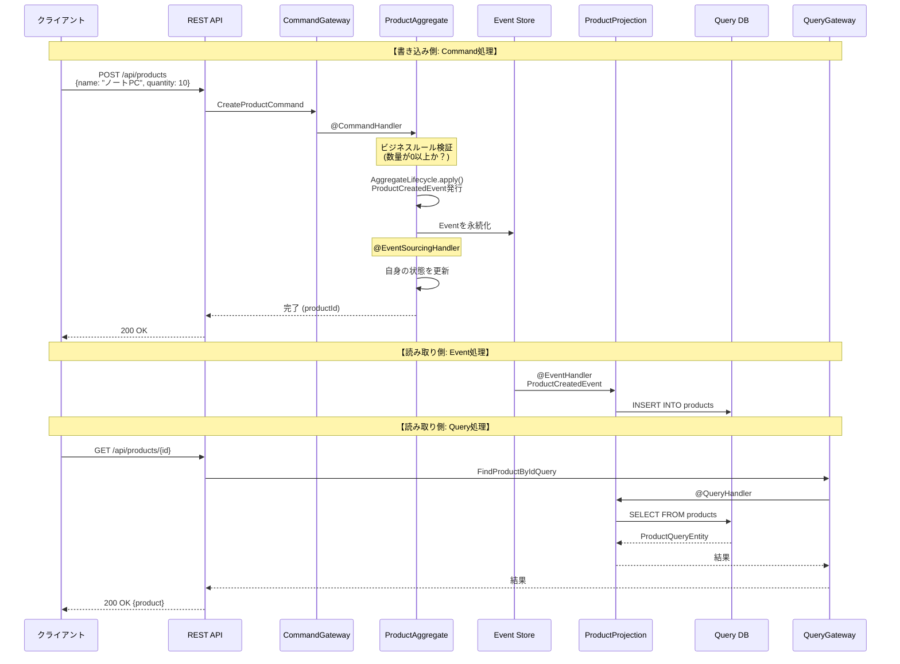
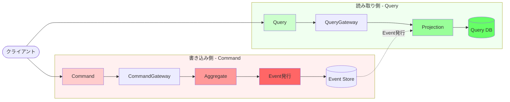
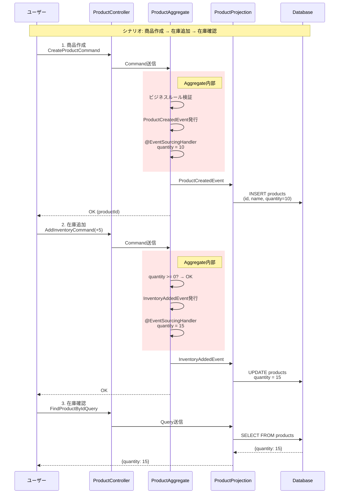

# Axon Framework 在庫管理デモ

Axon FrameworkとSpring Bootを使った商品在庫管理アプリケーションです。Event SourcingとCQRSパターンの基本を学ぶための最小限の実装です。

## プロジェクト構成

```
src/main/kotlin/com/example/inventory/
├── aggregate/          # Aggregate (ビジネスロジックとイベント発行)
│   └── ProductAggregate.kt
├── command/            # Commands (書き込みリクエスト)
│   ├── CreateProductCommand.kt
│   ├── AddInventoryCommand.kt
│   └── RemoveInventoryCommand.kt
├── event/              # Events (状態変更を表すイベント)
│   ├── ProductCreatedEvent.kt
│   ├── InventoryAddedEvent.kt
│   └── InventoryRemovedEvent.kt
├── query/              # Query側 (読み取り専用モデル)
│   ├── ProductQueryEntity.kt
│   ├── ProductRepository.kt
│   ├── ProductProjection.kt
│   ├── FindAllProductsQuery.kt
│   └── FindProductByIdQuery.kt
├── api/                # REST API
│   ├── ProductController.kt
│   ├── CreateProductRequest.kt
│   └── UpdateInventoryRequest.kt
└── InventoryApplication.kt
```

## Axon Frameworkの主要コンセプト

### 1. Command（コマンド）
- システムへの書き込みリクエスト
- 商品作成、在庫追加、在庫減少など
- `@TargetAggregateIdentifier`でAggregateを特定

### 2. Event（イベント）
- システム内で発生した事実を表す
- 過去形で命名（ProductCreated、InventoryAdded）
- Event Sourcingの基盤

### 3. Aggregate（アグリゲート）
- ビジネスロジックの中心
- Commandを受け取り、検証してEventを発行
- `@CommandHandler`でCommandを処理
- `@EventSourcingHandler`で自身の状態を更新

### 4. Projection（プロジェクション）
- Eventを受け取りQueryモデルを更新
- `@EventHandler`でEventを処理
- `@QueryHandler`でQueryに応答

### 5. CQRS（Command Query Responsibility Segregation）
- 書き込み（Command）と読み取り（Query）を分離
- 書き込み側: Aggregate
- 読み取り側: Projection + Query Model

## 実行方法

### 1. アプリケーションの起動

```bash
# Gradleを使用
./gradlew bootRun

# またはIDEから InventoryApplication.kt を実行
```

### 2. API使用例

#### 商品を作成
```bash
curl -X POST http://localhost:8080/api/products \
  -H "Content-Type: application/json" \
  -d '{"name": "ノートPC", "initialQuantity": 10}'
```

レスポンス: `"3fa85f64-5717-4562-b3fc-2c963f66afa6"` (商品ID)

#### すべての商品を取得
```bash
curl http://localhost:8080/api/products
```

#### 特定の商品を取得
```bash
curl http://localhost:8080/api/products/3fa85f64-5717-4562-b3fc-2c963f66afa6
```

#### 在庫を追加
```bash
curl -X POST http://localhost:8080/api/products/3fa85f64-5717-4562-b3fc-2c963f66afa6/add-inventory \
  -H "Content-Type: application/json" \
  -d '{"quantity": 5}'
```

#### 在庫を減少
```bash
curl -X POST http://localhost:8080/api/products/3fa85f64-5717-4562-b3fc-2c963f66afa6/remove-inventory \
  -H "Content-Type: application/json" \
  -d '{"quantity": 3}'
```

### 3. H2 Database Console

開発用のH2コンソールにアクセスできます:
- URL: http://localhost:8080/h2-console
- JDBC URL: `jdbc:h2:mem:inventory`
- Username: `sa`
- Password: (空白)

## 学習ポイント

### Event Sourcingの流れ

1. **Commandの送信**: REST API → CommandGateway
2. **Aggregateで処理**:
   - `@CommandHandler`がCommandを受け取る
   - ビジネスルールを検証
   - `AggregateLifecycle.apply()`でEventを発行
3. **Event Sourcing**:
   - `@EventSourcingHandler`でAggregateの状態を更新
   - Eventは永続化される（Event Store）
4. **Projectionで更新**:
   - `@EventHandler`がEventを受け取る
   - QueryモデルをUpdate（データベース）
5. **Queryの実行**:
   - REST API → QueryGateway
   - `@QueryHandler`がQueryを処理
   - Queryモデルから結果を返す

### 全体のシーケンス図



### Aggregateの内部フロー

```mermaid
flowchart TD
    Start[Command受信] --> Validate{ビジネスルール<br/>検証}

    Validate -->|検証OK| ApplyEvent[AggregateLifecycle.apply<br/>Eventを発行]
    Validate -->|検証NG| Error[例外をスロー]

    ApplyEvent --> EventStore[(Event Store<br/>に永続化)]

    EventStore --> EventSourcing[@EventSourcingHandler<br/>自身の状態を更新]

    EventSourcing --> UpdateState[Aggregateの<br/>フィールドを更新]

    UpdateState --> Complete[完了]
    Error --> End[エラー返却]
    Complete --> End

    style ApplyEvent fill:#ff9999
    style EventSourcing fill:#99ccff
    style EventStore fill:#ffcc99
```

### CQRSの全体像（書き込みと読み取りの分離）



### 商品在庫管理の具体例



### Event Sourcingの再構築の仕組み

```mermaid
flowchart TD
    Start[Aggregateの状態を<br/>再構築したい] --> Load[Event Storeから<br/>全イベントを読み込み]

    Load --> E1[Event 1:<br/>ProductCreatedEvent<br/>quantity = 10]
    E1 --> Apply1[@EventSourcingHandler<br/>quantity = 10]

    Apply1 --> E2[Event 2:<br/>InventoryAddedEvent<br/>+5]
    E2 --> Apply2[@EventSourcingHandler<br/>quantity = 15]

    Apply2 --> E3[Event 3:<br/>InventoryRemovedEvent<br/>-3]
    E3 --> Apply3[@EventSourcingHandler<br/>quantity = 12]

    Apply3 --> Final[最終状態:<br/>quantity = 12]

    style E1 fill:#ffcccc
    style E2 fill:#ffcccc
    style E3 fill:#ffcccc
    style Final fill:#ccffcc
```

### コードの重要ポイント

**ProductAggregate.kt** が最も重要なファイルです：

1. **@CommandHandler** - Commandを受け取る入口
   ```kotlin
   @CommandHandler
   constructor(command: CreateProductCommand) {
       // ビジネスルール検証
       require(command.initialQuantity >= 0) { "初期在庫数は0以上である必要があります" }

       // Eventを発行
       AggregateLifecycle.apply(ProductCreatedEvent(...))
   }
   ```

2. **AggregateLifecycle.apply()** - Eventを発行
   - この時点でEventがEvent Storeに永続化される
   - 他のコンポーネント（Projection）にEventが配信される

3. **@EventSourcingHandler** - 自分の状態を更新
   ```kotlin
   @EventSourcingHandler
   fun on(event: ProductCreatedEvent) {
       this.productId = event.productId
       this.name = event.name
       this.quantity = event.initialQuantity
   }
   ```

この3つのステップが、Event Sourcingの核心です！

### 重要な設定

`application.properties`の重要な設定:

```properties
# Axon Serverを無効化（単体動作モード）
axon.axonserver.enabled=false

# Event StoreとしてJPAを使用（H2 Database）
```

## 次のステップ

このプロジェクトを拡張するアイデア:

1. **Saga実装**: 複雑なビジネスプロセスの実装
2. **イベントリプレイ**: 過去のイベントから状態を再構築
3. **複数のProjection**: 異なる用途の読み取りモデル
4. **Deadlineハンドリング**: 時間ベースのイベント
5. **Axon Serverの導入**: 分散システムとしての運用

## 依存関係

- Spring Boot 3.2.0
- Axon Framework 4.9.1
- H2 Database（開発用インメモリDB）
- Spring Data JPA

## 参考資料

- [Axon Framework公式ドキュメント](https://docs.axoniq.io/)
- [CQRSパターン](https://martinfowler.com/bliki/CQRS.html)
- [Event Sourcing](https://martinfowler.com/eaaDev/EventSourcing.html)
